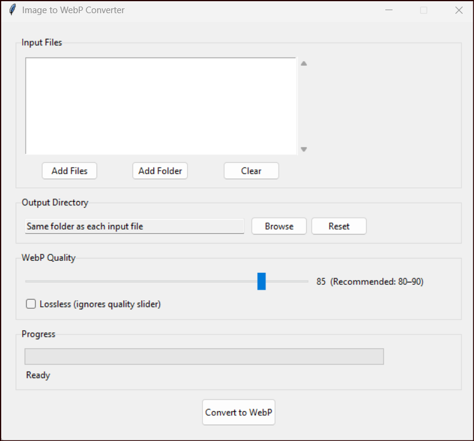

# Image to WebP Converter

A lightweight desktop GUI application that converts common image formats to WebP — with adjustable quality, lossless mode, and batch processing support.

Built with Python, Tkinter, and Pillow. No internet connection required. Works on Windows, macOS, and Linux.

---

## Features

- **Broad format support** — converts PNG, JPEG, BMP, TIFF, GIF, ICO, and HEIC/HEIF (with optional plugin)
- **Adjustable quality** — slider from 1 to 100 with live hints
- **Lossless mode** — pixel-perfect output, ignores the quality slider
- **Batch conversion** — add individual files or an entire folder at once
- **Custom output directory** — save WebP files to a separate folder or alongside the originals
- **Progress tracking** — progress bar and per-file status label
- **Transparency handling** — images with alpha channels (RGBA, PNG transparency) are preserved correctly
- **Duplicate prevention** — adding the same file twice is silently ignored
- **Error reporting** — if any file fails, a summary dialog lists exactly which ones and why

---

## Screenshots



---

## Requirements

- Python 3.10 or higher
- [Pillow](https://python-pillow.org/) >= 9.0
- [pillow-heif](https://github.com/bigcat88/pillow_heif) *(optional — only needed for HEIC/HEIF support)*

`tkinter` is included with the standard Python installer on all platforms. No separate install is needed.

---

## Installation

**1. Clone the repository**

```bash
git clone https://github.com/mnadeemsalam001/image-to-webp.git
cd image-to-webp
```

**2. Install dependencies**

```bash
pip install pillow
```

For HEIC/HEIF support (iPhone photos, etc.), also install:

```bash
pip install pillow-heif
```

> HEIC support is optional. The app will still run and convert all other formats if `pillow-heif` is not installed.

---

## Usage

```bash
python image_to_webp.py
```

### Step-by-step

1. **Add files** — click **Add Files** to pick individual images, or **Add Folder** to bulk-add all supported images from a folder.
2. **Choose output location** — by default, converted files are saved in the same folder as the original. Click **Browse** to choose a different output directory.
3. **Set quality** — drag the slider (1–100). The recommended range is **80–90** for a good size/quality balance.
4. **Lossless mode** *(optional)* — tick the checkbox for pixel-perfect output. This ignores the quality slider.
5. **Convert** — click **Convert to WebP**. The progress bar tracks each file. A summary dialog appears when done.

### Notes

- Output files are named `<original_filename>.webp` and will **overwrite** any existing `.webp` file with the same name in the output directory.
- GIF files are converted as static images (only the first frame is used).
- ICO files with multiple sizes are opened at the largest available size.

---

## Supported Input Formats

| Format | Extensions |
|--------|------------|
| PNG | `.png` |
| JPEG | `.jpg`, `.jpeg` |
| BMP | `.bmp` |
| TIFF | `.tiff`, `.tif` |
| GIF | `.gif` |
| ICO | `.ico` |
| HEIC / HEIF | `.heic`, `.heif` *(requires `pillow-heif`)* |

---

## Why WebP?

WebP is a modern image format developed by Google that provides:

- **25–34% smaller** file sizes compared to JPEG at equivalent visual quality
- **Lossless compression** that is ~26% smaller than PNG
- **Transparency support** (like PNG) with smaller file sizes
- **Wide browser support** — all major browsers since 2020

It is the recommended format for web images.

---

## Project Structure

```
image-to-webp/
├── image_to_webp.py   # Main application — single file, no package structure needed
└── README.md
```

---

## Contributing

Contributions are welcome. To suggest a feature or report a bug, open an issue on GitHub.

If you want to contribute code:

1. Fork the repository
2. Create a feature branch (`git checkout -b feature/your-feature`)
3. Commit your changes
4. Open a pull request

---

## License

This project is licensed under the [MIT License](https://opensource.org/licenses/MIT) — free to use, modify, and distribute.

---

## Author

Built by [Nadeem Salam](https://github.com/mnadeemsalam001).
